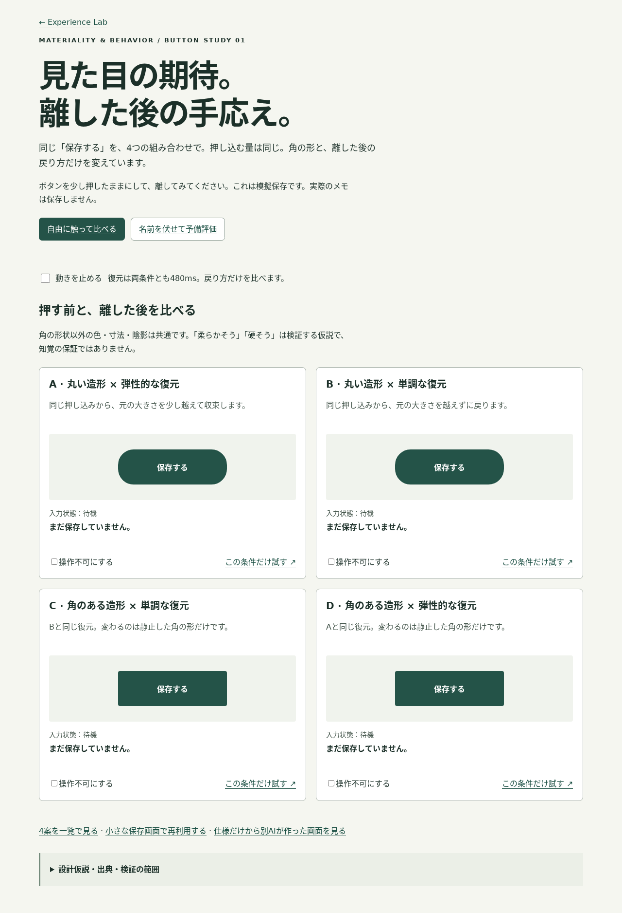
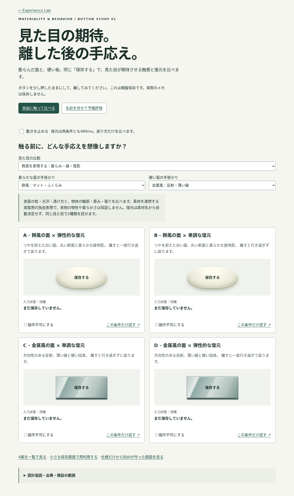

# Materiality & Behavior PoC — 実装・検証記録

2026-10-08 / Lab限定 / recommended: null / mainへ未統合。

[探索](../gallery/lab/materiality-behavior/) · [予備評価](../gallery/lab/materiality-behavior/?mode=evaluate) · [AI向け仕様](MATERIALITY-BEHAVIOR.md) · [判断と出典](SOURCE-DECISIONS-MATERIALITY.md)

## 基準と依存関係

前回「andm-ui — Materiality & Behavior 研究・概念設計」の全文、DESIGN / AGENTS / EXPERIENCE / SOURCE-FIRST / DESIGN-PHILOSOPHIES、既存Button・Motion・Series・Researchを確認して実装した。前回の本文確認記録と、今回の独自実装値を区別している。今回は公式Series値の再調査・変更はしていない。

mainは`fabf0c3d76bbb3a3627950c4f51954d751d89e9a`。PR #8 (`audit/source-first-components`)・#9 (`feature/philosophy-lab-poc`)はどちらもopen・未統合。今回の`feature/materiality-behavior-poc`は#9のLab/文書構造に依存する独立worktree。レビュー差分を絞るためPR baseを#9のブランチにする。#8へのコード依存はない。元の監査ブランチにあった13件の未コミット変更は元worktreeに残している。

プレビューは既存Galleryの監査変更を維持し、新Labページとリンクを追加する。Materiality側だけ、このブランチで検証したCore CSSをプレビュー用ファイルとして固定する。公式Series・Coreを実験のために変更しない。

## 実装と構造

Appearance（角）×Release軌道の2×2。A=丸い/弾性、B=丸い/単調、C=角あり/単調、D=角あり/弾性。既存 `.andm-btn andm-btn--filled` とNative Buttonを局所Extendし、新Component/Series/共通Tokenを作っていない。

色・寸法・ラベル・押下scale .94・press 80ms・release 480ms・処理結果を共通にした。固定したhit target/文字/focusの内側で装飾面だけを変形する。単調curveは`.2,0,.2,1`、弾性curveは`.34,2.5,.3,1`。物理springではない。初期曲線の小さな超過を視認しやすく調整した局所刺激で、知覚や好みの実証はしていない。

CSSで軌道を実装し、JSはNative activationを維持しながら保持・解除・中断・結果・評価ログを管理する。復元中に再入力可能。成功表示は復元終了を待たない。実サーバーはなく、保存は模擬処理。

評価モードでは名称を中立IDにし、4条件とIDを別々にランダム化。期待を先に必須記録し、その後で期待一致・好み・明確さを別々に記録する。期待入力前のNative disabledでも評価対象の通常色を維持し、色変化を混ぜない。終了後JSONに条件対応・刺激値・イベント・motion設定・入力方式を出力する。採用値はnull、外部送信・自動保存なし。厳密な盲検やcounterbalanceではない。

## 検証結果

| 検証 | 結果・範囲 |
|---|---|
| npm run build | 成功 |
| npm run audit:tokens | 成功。199定義、未定義の必須参照なし |
| npm run audit:design-knowledge | 成功。既存18レコード、schema subset・参照・null・Runtime境界を維持。JSON/schemaは今回無変更 |
| npm pack --dry-run | Research / Lab / 新スクリプトが配布対象に入らないことを確認 |
| CSS/API差分 | src/styles、公式Series、既存58部品、package.jsonは変更なし |
| Chromium 153 / Playwright | 探索・評価・D単独・使用例・独立AI生成画面の5画面 × 4幅 × 文字100/200% = 40条件。横はみ出しなし |
| 文字拡大 | root font-size 16→32px。ブラウザの全画面zoomや実機の設定とは別 |
| 軌道 | 全条件で押下scale .94。A/Dは1を超えて収束、B/Cは1以下から復元。寸法・通常色共通。実測詳細はbrowser-results.json |
| 連続・中断 | 8連続click、領域外解除、pointercancel、Space+Escape、window blur、取消後の支援技術相当clickを確認。入力保持が残らない |
| Native操作 | Tab/Shift+Tab、Enter、Space、3pxのfocus、Native disabled、共通成功表示を確認 |
| Reduced Motion | OS設定と手動停止で押下中もtransform/transitionを停止。結果表示は機能する |
| 評価 | 4試行完走、操作前gate、7段階の別々の回答、4条件の重複なし、中立ID、JSON exportとnull採用を確認 |
| 日本語・長文 | 320px/文字200%の長いラベル、長いメモ、Native必須form validationを確認 |
| タッチ | Chromium hasTouchの390pxエミュレーションで5連続tap。実機ではない |
| 自動アクセシビリティ | axe-coreのWCAG 2A/2AA/2.1AA/2.2AAタグ、5画面で検出違反0。全AA適合を保証しない |
| Gallery入口 | 4幅 × 文字100/200%で2つの実験リンクが見え、重ならないことを確認。既存のsticky toolbar外に置き、アンカー移動を妨げない |
| 既存回帰 | Galleryの58部品、検索、Carbon切替、旧Labのbrief/dialog/Escape。Philosophy Cの選択/linear保持、比較/単独/狭幅、export、focusなどを再確認 |
| スクリーンショット | 390/1280pxの探索、評価、使用例、独立生成画面を取得。探索のdesktop/mobileと評価mobileを目視、文字・ボタン・読み順を確認 |
| JS例外 | 検証中0 |
| Firefox / WebKit | 起動を試したが実行ファイルがないため未検証。WebKitでSafari実機を代替した扱いにもしない |

表示確認で、狭幅200%のgrid最小幅と英字行のはみ出し、Reduced Motionの詳細度不足を修正した。取消したSpaceの保留activationと、その後の独立activationを区別するcontrollerも確認した。

検証コマンド（既存Playwright/Chromium/axeを指定、プロジェクト依存は増やさない）：

```sh
INCLUDE_REUSE=1 PLAYWRIGHT_MODULE=/path/to/playwright/index.mjs \
CHROMIUM_EXECUTABLE_PATH=/path/to/chromium AXE_SCRIPT=/path/to/axe.min.js \
QA_OUTPUT=/tmp/andm-materiality-qa node scripts/check-materiality-browser.mjs
```

記録：[browser-results.json](../research/analysis/materiality-behavior-validation/browser-results.json)、[回帰結果](../research/analysis/materiality-behavior-validation/regression-results.json)。ResearchはBuild/Runtime/npm非依存。



[探索390px](../research/analysis/materiality-behavior-validation/explore-390.webp) · [評価390px](../research/analysis/materiality-behavior-validation/modeevaluate-390.webp)

## AIによる独立再利用テスト

別の生成タスクへ仕様書・Core button.css・controls READMEだけを渡した。既存PoC実装を読まず、controllerもimportせず、[観察メモ画面](../gallery/lab/materiality-behavior/reuse-test/)を生成した。Native必須textarea、既存Button、局所CSS、模擬保存の独立結果、motion停止、disabledを備える。

初回コードのブラウザ検証で `Reuse: Enter activation must not end held visual` が失敗。Enterのclick時にreleaseを呼び、キーが押されたままなのに面を戻していた。また取消フラグが後の支援技術activationを妨げ得ることをコードレビューで発見した。root側で修正し、keyup/取消後のactivation・連続操作・Reduced Motionを再検証して通過した。初回完全成功とは扱わない。

guideにはonState/onConfirm payload、Enter成立と視覚保持の分離、取消の適用範囲、Coreの背景/pseudo/active解除、Reduced Motionの詳細度を追記した。独立画面のcurveは生成時仕様の`.34,1.65,.3,1`を保持し、4条件PoCの最終刺激とは区別する。具体値のコピーに加え、操作契約を正しく保てるかが重要だった。

既存部品再利用と局所拡張は可能だったが、単一タスクでAIの一般的な設計判断能力を証明しない。ユーザー評価、実保存、ネットワーク失敗、screen readerの読み上げは未実施。

## Core接続と次の候補

既存Button APIは足りる。Motion Characterにはelasticity/復元/interruptibilityの記述を補う余地があるが、新Token/modifierを自動追加する根拠はまだない。press×compressとrelease復元は既存の概念に接続できる。Materiality独自Runtimeレイヤーは不要。

次は実機・screen readerの取消/読み上げ検証、刺激が識別できるかの予備ユーザー評価、同じ契約の保存/選択/破壊操作への適用を行う。複数用途で必要性が確認できたら視覚面・解除契約の共通化を提案する。速度/角/scaleの個別操作、セッションの再開、より厳密な割付はその後の研究対象。

## 未検証

Safari/Firefox、実機タッチ、スクリーンリーダー、ブラウザ全画面zoom200%、多様な入力機器・force/振動/音、実保存の成功/失敗、XR、ユーザーによる知覚差・好み・疲労、尺度妥当性・統計的効果。今回の成功表示は操作検証用で、これらへの適合や効果は保証しない。

## 変更ファイル

- 新設：`gallery/lab/materiality-behavior/{index.html,button.css,button.js,lab.css,lab.js,example.html}`
- 新設：同ディレクトリの`reuse-test/{index.html,local.css,local.js}`
- 新設：`docs/{MATERIALITY-BEHAVIOR.md,MATERIALITY-VALIDATION.md,SOURCE-DECISIONS-MATERIALITY.md}`
- 新設：`scripts/check-materiality-browser.mjs`
- 新設：`research/analysis/materiality-behavior-validation/` の結果JSON2件、スクリーンショット3件
- 追記：`README.md`、`docs/EXPERIENCE.md`、`docs/SOURCE-DECISIONS.md`、`gallery/index.html`、`gallery/lab/index.html`

既存Philosophy PoC、Core、公式Series、Token、Research catalog/schemaは変更しない。

## 追加検証：表面・造形プロフィール

角丸だけでは質感を想像できないという利用者の指摘を反映。探索の既定を餅風/金属風へ変更し、餅風・スライム風・ボール風と金属風・石風のNative選択を追加した。Surfaceの光沢/粒/透ける縁と、Formの膨らみ/球面/板/塊を区別して記述する。CSSで表現する独自メタファーであり、実際の物性の再現や知覚の実証ではない。

「角だけ」の統制探索へ切替可能。予備評価の見た目、入力、刺激version、exportは維持。探索では色/陰影/輪郭/ボール寸法など複数要因が変わるため、統制条件と混ぜて評価しない。Surfaceや素材名から復元を自動決定しない。

- build / audit:tokens / audit:design-knowledge / diffチェック通過。
- Chromiumで6画面×4幅×文字100/200%=48条件、さらに素材6組×4幅×文字100/200%=48条件。横はみ出しなし。
- axeの該当WCAGタグで12画面・組の検出違反0。gradientの全領域のコントラストを自動保証するものではない。
- Native select、URLのプロフィール保持、表示切替時の保存回数保持、ボールのSpace操作、Reduced Motion、既存の連続操作/取消/4試行export/独立AI例を確認。
- desktopの餅/金属、mobileのスライム/石・ボール/石を目視確認。文書と操作領域は変形させない。
- 今回のプロフィールを渡した独立AI再生成は未実施。以前の独立再利用結果はその時点の仕様の記録。
- Safari/Firefox、実機、screen reader、素材知覚・好み・要因別効果は引き続き未検証。

[追加の結果JSON](../research/analysis/materiality-behavior-validation/appearance-results.json)



[スライム風・石風](../research/analysis/materiality-behavior-validation/slime-stone-390.webp) · [ボール風・石風](../research/analysis/materiality-behavior-validation/ball-stone-390.webp)
